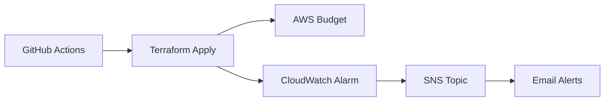

# **AWS Budget & Alarm Automation with Terraform and GitHub CI/CD**  
**Documentation**  

## **1. Overview**  
This project automates the setup of **AWS Budgets** and **CloudWatch Alarms** for cost monitoring using Terraform, deployed via GitHub Actions CI/CD. It provides:  
- **Real-time spending alerts** via email  
- **Forecasted and actual budget thresholds**  
- **Infrastructure as Code (IaC)** with Terraform  
- **GitOps workflow** with automated deployments  

---

## **2. Architecture**  


**Key Components**:  
| Service | Purpose |  
|---------|---------|  
| **AWS Budgets** | Track monthly costs against thresholds |  
| **CloudWatch Alarms** | Trigger alerts when costs exceed limits |  
| **SNS** | Send email/SMS notifications |  
| **Terraform** | Infrastructure as Code management |  
| **GitHub Actions** | Automated CI/CD pipeline |  

---

## **3. Prerequisites**  
### **AWS Setup**  
1. **IAM User** with permissions:  
   ```json
   {
     "Version": "2012-10-17",
     "Statement": [
       {
         "Effect": "Allow",
         "Action": [
           "budgets:*", 
           "sns:*",
           "cloudwatch:*"
         ],
         "Resource": "*"
       }
     ]
   }
   ```
2. **AWS Credentials** (Access Key + Secret Key)  

### **GitHub Setup**  
1. Repository with Terraform files  
2. GitHub Secrets configured:  
   - `AWS_ACCESS_KEY_ID`  
   - `AWS_SECRET_ACCESS_KEY`  

---

## **4. Repository Structure**  
```
aws-budget-monitoring/
├── .github/
│   └── workflows/
│       └── deploy.yml      # CI/CD Pipeline
├── main.tf                # Core Terraform
├── variables.tf           # Input variables
├── outputs.tf             # Output values
└── README.md             # Project documentation
```

---

## **5. Configuration Guide**  
### **A. Terraform Variables (`variables.tf`)**  
```hcl
variable "monthly_budget_amount" {
  description = "Monthly budget limit (USD)"
  type        = number
  default     = 100
}

variable "notification_email" {
  description = "Email for alerts"
  type        = string
}
```

### **B. Core Resources (`main.tf`)**  
#### **1. SNS Topic for Alerts**  
```hcl
resource "aws_sns_topic" "alerts" {
  name = "budget-alerts"
}
```

#### **2. AWS Budget**  
```hcl
resource "aws_budgets_budget" "monthly" {
  budget_type  = "COST"
  limit_amount = var.monthly_budget_amount
  time_unit    = "MONTHLY"
  
  notification {
    threshold          = 80  # Alert at 80% of budget
    notification_type = "FORECASTED"
    subscriber_email_addresses = [var.notification_email]
  }
}
```

#### **3. CloudWatch Alarm**  
```hcl
resource "aws_cloudwatch_metric_alarm" "billing" {
  alarm_name  = "monthly-billing-alarm"
  metric_name = "EstimatedCharges"
  threshold   = var.monthly_budget_amount
  alarm_actions = [aws_sns_topic.alerts.arn]
}
```

---

## **6. CI/CD Pipeline (GitHub Actions)**  
### **Workflow File (`.github/workflows/deploy.yml`)**  
```yaml
name: Deploy Budget Alerts
on:
  push:
    branches: [main]
  workflow_dispatch:

jobs:
  deploy:
    runs-on: ubuntu-latest
    environment: production
    
    steps:
      - uses: actions/checkout@v4
      
      - name: Configure AWS Credentials
        uses: aws-actions/configure-aws-credentials@v4
        with:
          aws-access-key-id: ${{ secrets.AWS_ACCESS_KEY_ID }}
          aws-secret-access-key: ${{ secrets.AWS_SECRET_ACCESS_KEY }}
          
      - name: Terraform Apply
        run: |
          terraform init
          terraform apply -auto-approve \
            -var="notification_email=${{ vars.NOTIFICATION_EMAIL }}" \
            -var="monthly_budget_amount=${{ vars.BUDGET_AMOUNT }}"
```

### **Secrets & Variables**  
| Type | Name | Description |  
|------|------|-------------|  
| **Secret** | `AWS_ACCESS_KEY_ID` | AWS IAM Access Key |  
| **Secret** | `AWS_SECRET_ACCESS_KEY` | AWS IAM Secret Key |  
| **Variable** | `NOTIFICATION_EMAIL` | Email for alerts |  
| **Variable** | `BUDGET_AMOUNT` | Budget limit (e.g., `5`) |  

---

## **7. Deployment Steps**  
1. **Clone the repository**:  
   ```bash
   git clone https://github.com/your-repo/aws-budget-monitoring.git
   ```
2. **Configure secrets/variables** in GitHub repo settings.  
3. **Merge to `main`** to trigger auto-deployment.  
4. **Verify**:  
   - Check AWS Budgets dashboard  
   - Confirm SNS email subscription  

---

## **8. Monitoring & Maintenance**  
### **A. Checking Alerts**  
- **AWS Console Paths**:  
  - Budgets: `AWS Cost Management > Budgets`  
  - CloudWatch: `CloudWatch > Alarms`  

### **B. Updating Budget Amount**  
1. Update `BUDGET_AMOUNT` variable in GitHub  
2. Push changes to `main`  

### **C. Destroying Resources**  
```bash
terraform destroy \
  -var="notification_email=your@email.com" \
  -var="monthly_budget_amount=5"
```

---

## **9. Best Practices**  
1. **Least Privilege**: Restrict IAM permissions to only required services.  
2. **Multi-Channel Alerts**: Add SMS/Slack via SNS subscriptions.  
3. **Budget Granularity**: Create separate budgets for different services.  

---

## **10. Troubleshooting**  
| Issue | Solution |  
|-------|----------|  
| Alerts not delivered | Confirm SNS email subscription |  
| Terraform apply fails | Check IAM permissions |  
| Budget not visible | Wait 24h for AWS Cost and Usage Report updates |  

---

## **11. Sample Outputs**  
After deployment:  
```bash
✅ Budget Name: monthly-cost-budget  
✅ SNS Topic ARN: arn:aws:sns:eu-west-1:123456789012:budget-alerts  
✅ CloudWatch Alarm: monthly-billing-alarm  
```

---

## **12. References**  
- [AWS Budgets Documentation](https://docs.aws.amazon.com/cost-management/latest/userguide/budgets-managing-costs.html)  
- [Terraform AWS Provider](https://registry.terraform.io/providers/hashicorp/aws/latest/docs)  